# Using Vault for Secret Management: A Practical Guide with Kubernetes

## Project Overview

This project demonstrates how to use **HashiCorp Vault** for secure secret management within Kubernetes. We'll explore real-world use cases for securely storing and retrieving secrets such as:

1. API URLs Done by **Mohamad**
2. Username and password Done by **Ammar**
3. Token-Based API Access Done by **Ali**
4. Database connection strings Done by **Yehia**

Vault will be integrated with **Kubernetes**.

### Contributors

- Mohamad *(API Fetcher use case)*
- Ali *(Token-Based API use case)*
- Yehia *(Database URL connection use case)*
- Ammar *(Username/password login use case)*

---

## Setup

- 2 AWS EC2 instances were initialized for this project choosing `ubuntu` as operating system
- One instance was used for the (API + Token) cases
- The other instance was used for the (Login + Database) cases
- For both instances the following steps were followed at the beginning:
  - Installing `kubectl` following this [guide](https://kubernetes.io/docs/tasks/tools/install-kubectl-linux/)
  - Installing `minikube` following this [guilde](https://minikube.sigs.k8s.io/docs/start/?arch=%2Flinux%2Fx86-64%2Fstable%2Fbinary+download) and using `kubectl` as an alias for `minikube kubectl --`
  - Installing `docker` and adding it to `sudo group` following this [guide](https://docs.docker.com/engine/install/ubuntu/)
  - Installing `helm` following this [guide](https://helm.sh/docs/intro/install/) and activating `vault` inside it following this [guide](https://developer.hashicorp.com/vault/docs/platform/k8s/helm/run)

---

## Use Case 1: API Fetcher App with Vault (By Mohamad)

In this section, we will deploy a Kubernetes-based application that securely fetches API data using secrets stored in HashiCorp Vault.

---

### 1. Verify Vault

Confirm the pod is running:

```bash
kubectl get pods
```

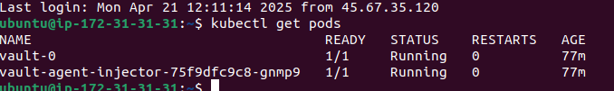

---

### 2. Configure Vault Secrets

Enable the KV v2 secrets engine and store your API URL secret:

```bash
# Connect to the Vault pod shell
kubectl exec -it vault-0 -- /bin/sh

# Enable KV v2 secrets engine at custom path "internal"
vault secrets enable -path=internal kv-v2

# Add the API URL secret to Vault
vault kv put internal/database/config api_url="https://jsonplaceholder.typicode.com/posts"

# Retrieve the secret to verify it was added
vault kv get internal/database/config
```

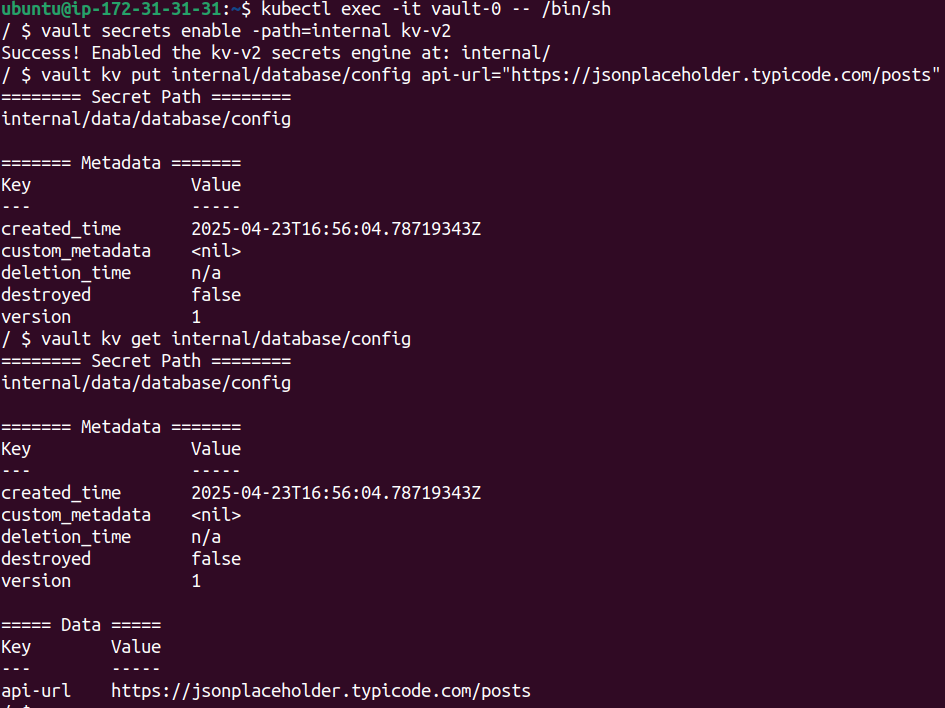

---

### 3. Configure Kubernetes Authentication

Inside the Vault pod:

```bash
# Enable the Kubernetes authentication method
vault auth enable kubernetes

# Configure Vault with the Kubernetes cluster API endpoint
vault write auth/kubernetes/config \
    kubernetes_host="https://$KUBERNETES_PORT_443_TCP_ADDR:443"

# Define a policy to allow read access to the API URL secret
vault policy write api-fetcher - <<EOF
path "internal/data/database/config" {
  capabilities = ["read"]
}
EOF

# Create a Kubernetes authentication role for the app
vault write auth/kubernetes/role/api-fetcher \
    bound_service_account_names=api-fetcher \
    bound_service_account_namespaces=default \
    policies=api-fetcher \
    ttl=24h

# Exit the Vault container
exit
```

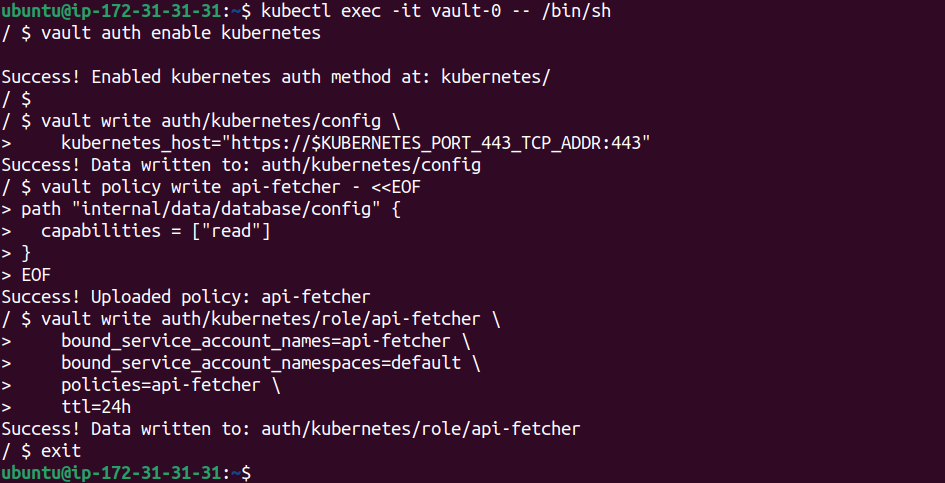

---

### 4. Build the API Fetcher App

This Flask-based app fetches data from an external API defined in the `API_URL` environment variable or query parameter.

```bash
# Build the Docker image
docker build . -t oshaheen1882051/fetcher-app:v-1.0.0 --no-cache

# Push the image to Docker Hub
docker push oshaheen1882051/fetcher-app:v-1.0.0
```

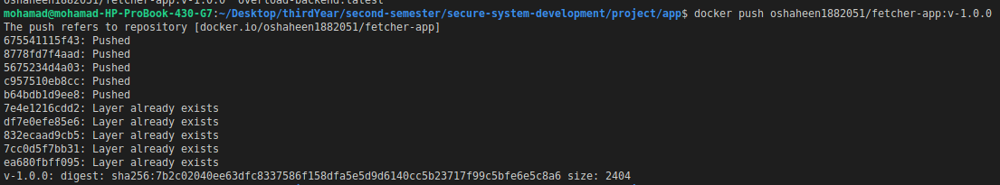
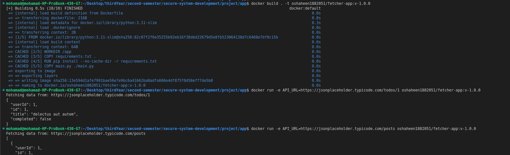

[Docker Hub Link for fetcher-app](https://hub.docker.com/r/oshaheen1882051/fetcher-app)

---

### 5. Create Helm Chart for `api-fetcher`

Create the chart:

```bash
helm create api-fetcher
```

#### Update `values.yaml`

```yaml
image:
  repository: oshaheen1882051/fetcher-app
  pullPolicy: Always
  tag: "v-1.0.0"

serviceAccount:
  create: true
  automount: true
  name: "api-fetcher"

vault:
  secretPath: "internal/data/database/config"
  secretKey: "api_url"
  role: "api-fetcher"

service:
  type: ClusterIP
  port: 8080
```

#### Update `templates/deployment.yaml` annotations

```yaml
annotations:
  vault.hashicorp.com/agent-inject: "true"
  vault.hashicorp.com/role: "{{ .Values.vault.role }}"
  vault.hashicorp.com/agent-inject-secret-database-config.txt: "{{ .Values.vault.secretPath }}"
  vault.hashicorp.com/agent-inject-template-database-config.txt: |
    {{`{{- with secret "`}}{{ .Values.vault.secretPath }}{{`" -}}`}}
    API_URL={{`{{ .Data.data.api_url }}`}}
    {{`{{- end }}`}}
```

---

### 6. Deploy the Chart

```bash
# Install the Helm chart for the application
helm install api-fetcher ./api-fetcher/
```

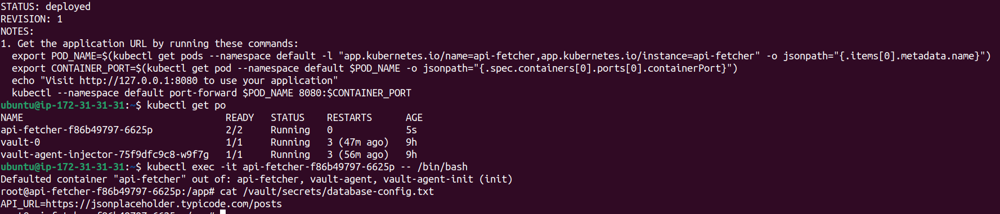

---

### 7. Test the API Fetcher App

Forward the service port and make a request:

```bash
# Forward port 8080 from the pod to localhost
kubectl port-forward api-fetcher-f86b49797-6625p 8080:8080

# Send a test request to the running app
curl http://localhost:8080
```

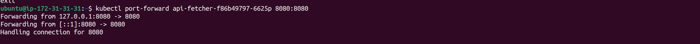
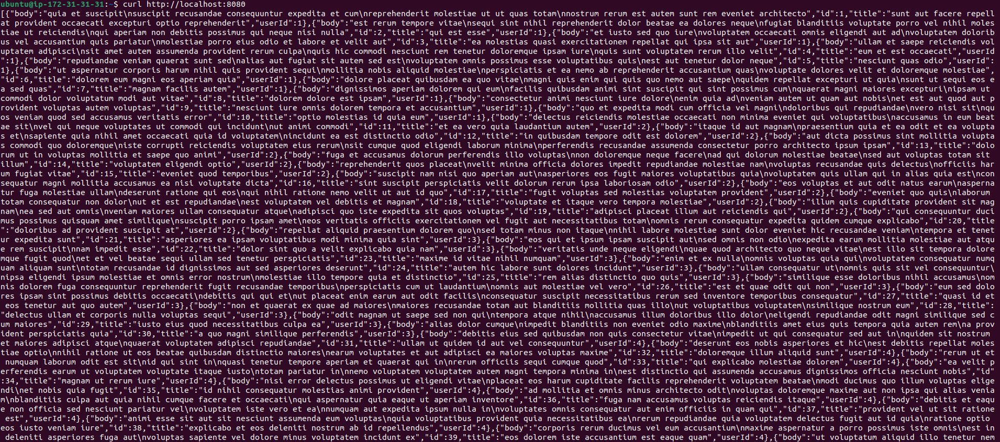

---

This use case by **Mohamad** demonstrates how to securely inject secrets into a Kubernetes-based application using Vault and Helm and retrive data from api.

## Use Case 2: Token-Based API Access (By Ali)

In this section we will show how to store an API URL and access token in Vault, inject them into a Kubernetes pod, and use them in a Flask app to authenticate requests.

---

### 1. Generate and Store the Token in Vault

#### a. Generate a random token locally

```bash
# Generate a 128-bit (16-byte) hex token
echo "$(openssl rand -hex 16)"  
# Example output: 0e5ca54075b7af0e785b75fe0f708517
```

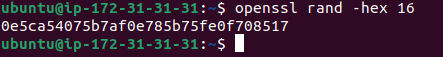

#### b. Store the token and API URL in Vault

```bash
vault kv put internal/token/api-client \
  api_url="https://jsonplaceholder.typicode.com/posts" \
  token="0e5ca54075b7af0e785b75fe0f708517"
```

---

### 2. Configure Vault Policy and Kubernetes Role

1. **Create a Vault policy** that grants read access to the token path:

   ```bash
   vault policy write extended-api-fetcher - <<EOF
   path "internal/data/token/api-client" {
     capabilities = ["read"]
   }
   EOF
   ```
2. **Define a Kubernetes auth role** using that policy:

   ```bash
   vault write auth/kubernetes/role/extended-api-fetcher \
     bound_service_account_names=extended-api-fetcher \
     bound_service_account_namespaces=default \
     policies=extended-api-fetcher \
     ttl=24h
   ```

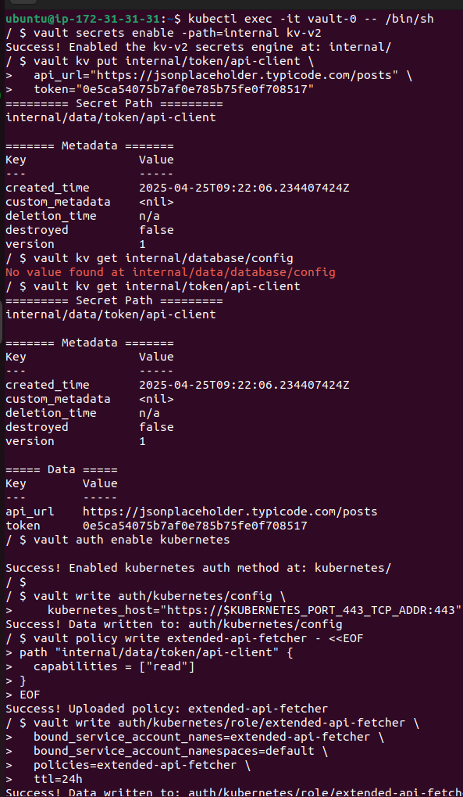

---

### 3. Build and Push the Docker Image

Ali’s Flask application reads the `API_URL` and `X-API-Token` header to authorize. Build and push:

```bash
# Build the image (no cache)
docker build . -t oshaheen1882051/extended-api-fetcher:v-1.0.0 --no-cache

# Push to Docker Hub
docker push oshaheen1882051/extended-api-fetcher:v-1.0.0
```

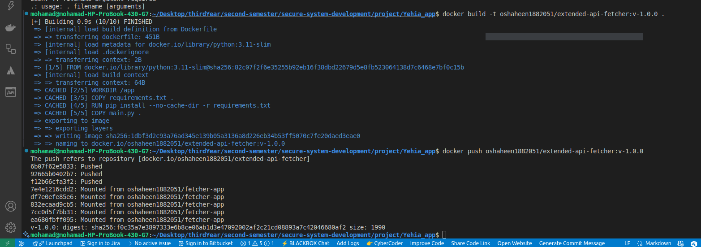

---

### 4. Prepare the Helm Chart

1. Create a new chart:

   ```bash
   helm create extended-api-fetcher
   ```
2. Update `values.yaml`:

   ```yaml
   image:
     repository: oshaheen1882051/extended-api-fetcher
     pullPolicy: Always
     tag: "v-1.0.0"

   serviceAccount:
     create: true
     automount: true
     name: extended-api-fetcher

   vault:
     role: extended-api-fetcher
     secretPath: internal/data/token/api-client
     apiUrlKey: api_url
     tokenKey: token

   service:
     type: ClusterIP
     port: 8080

   livenessProbe:
     httpGet:
       path: /healthz
       port: http
     initialDelaySeconds: 10
     periodSeconds: 10

   readinessProbe:
     httpGet:
       path: /healthz
       port: http
     initialDelaySeconds: 5
     periodSeconds: 5
   ```
3. Add Vault annotations in `templates/deployment.yaml`:

   ```yaml
   metadata:
     annotations:
       vault.hashicorp.com/agent-inject: "true"
       vault.hashicorp.com/role: "{{ .Values.vault.role }}"
       vault.hashicorp.com/agent-inject-secret-api_url: "{{ .Values.vault.secretPath }}"
       vault.hashicorp.com/agent-inject-template-api_url: |
         {{`{{- with secret "`}}{{ .Values.vault.secretPath }}{{`" -}}`}}
         {{`{{ .Data.data.api_url }}`}}
         {{`{{- end }}`}}
       vault.hashicorp.com/agent-inject-secret-token: "{{ .Values.vault.secretPath }}"
       vault.hashicorp.com/agent-inject-template-token: |
         {{`{{- with secret "`}}{{ .Values.vault.secretPath }}{{`" -}}`}}
         {{`{{ .Data.data.token }}`}}
         {{`{{- end }}`}}
   ```

---

### 5. Deploy and Test

1. Install the Helm chart:

   ```bash
   helm install extended-api-fetcher ./extended-api-fetcher
   ```

   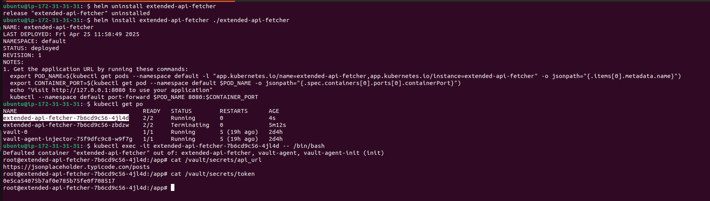
2. Port-forward and call the service with the token in a header:

   ```bash
   kubectl port-forward svc/extended-api-fetcher 8080:8080

   curl -v \
     -H "X-API-Token: 0e5ca54075b7af0e785b75fe0f708517" \
     http://localhost:8080/
   ```

   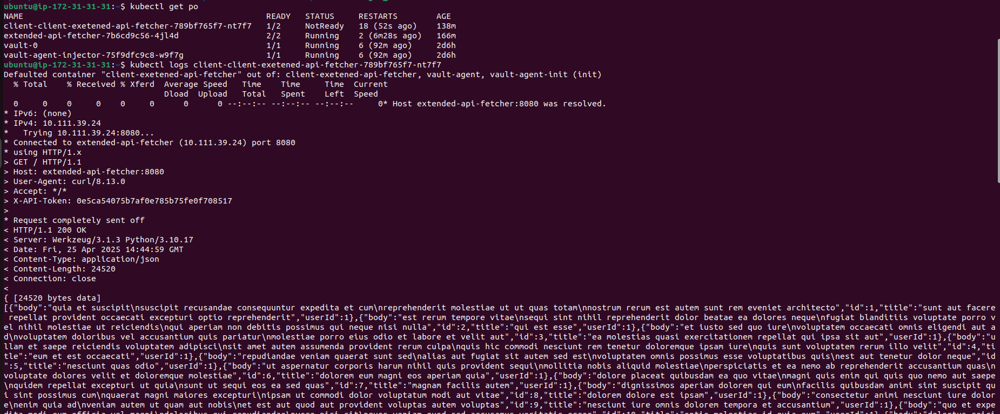
3. Check server logs to confirm authorization succeeded:

   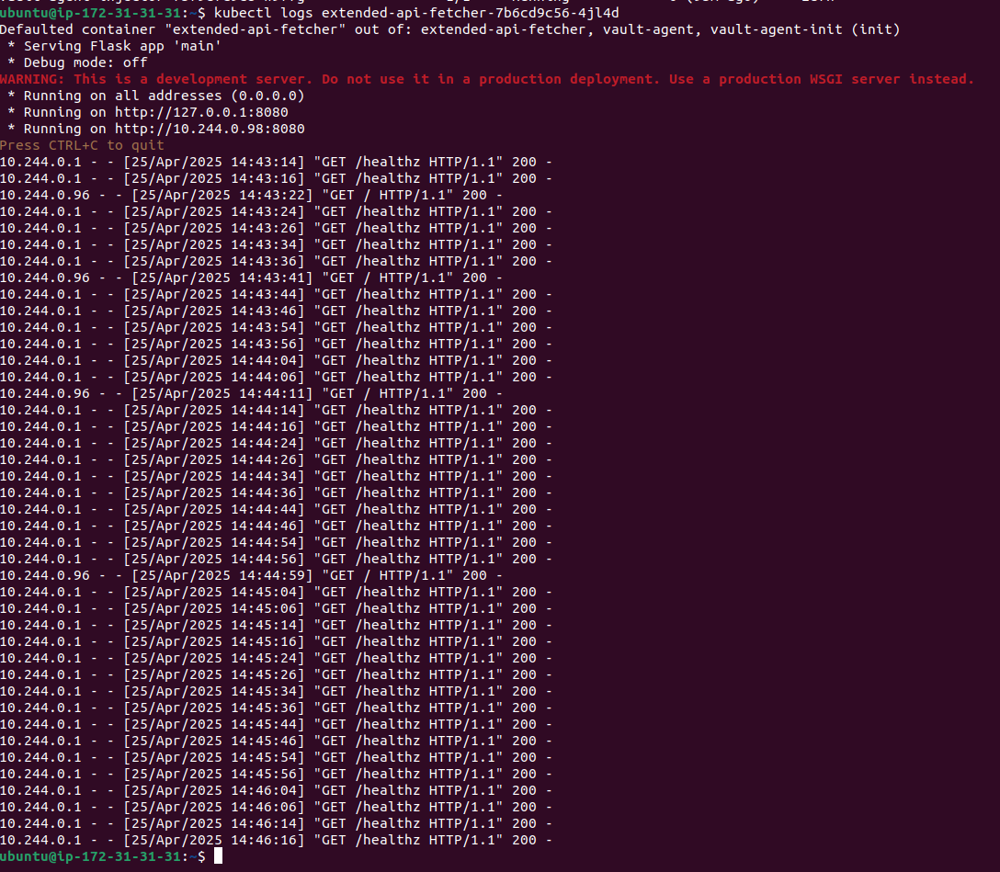
4. Verify the JSON data returned from the API:

   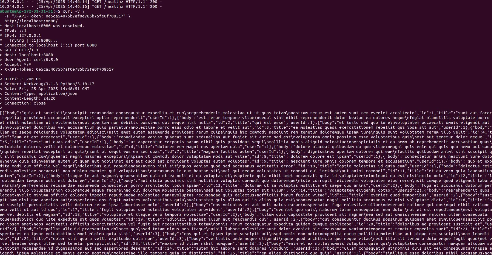

Ali’s token-based use case demonstrates how to store and inject simple credentials with Vault and use them in a Kubernetes application for secure API access.

---

## Use Case 3: Database (By Yehia)

In this section, we will create `MongoDB Server` with hardcoded username/password, save them as secrets inside `vault`, and inject them into `MongoDB Client`

### 1. Setup MongoDB Server

A `MongoDB Server` was setup using helm chart with the following `values.yaml` file:

```
image:
  repository: mongo
  tag: latest
  pullPolicy: IfNotPresent

service:
  type: ClusterIP
  port: 27017
  nodePort: null

auth:
  rootUser: admin
  rootPassword: mypassword
  enabled: true

persistence:
  enabled: false
```

with the following hardcoded credintials:

- username: adming
- password: mypassword

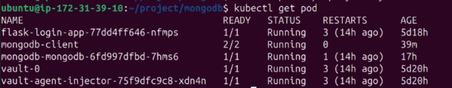

### 2. Setup Secrets

Let's store the previous credintials into vault and verify that they got stored

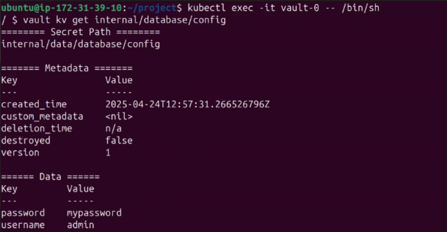

### 3. Setup MongoDB Client

Let's setup a `MongoDB Client Pod` using the following `mongodb-client-pod.yaml` file

```
apiVersion: v1
kind: Pod
metadata:
  name: mongodb-client
  annotations:
    vault.hashicorp.com/agent-inject: "true"
    vault.hashicorp.com/role: "internal-app"
    vault.hashicorp.com/agent-inject-secret-mongodb-creds: "internal/data/database/config"
    vault.hashicorp.com/agent-inject-template-mongodb-creds: |
      {{- with secret "internal/data/database/config" -}}
      export MONGO_USER="{{ .Data.data.username }}"
      export MONGO_PASS="{{ .Data.data.password }}"
      {{- end }}
spec:
  serviceAccountName: internal-app
  containers:
  - name: mongo-client
    image: mongo:6.0
    command: ["sleep", "infinity"]
```

such that our secrets will get injected into it


### 4. Connect to The Server

Let's access the client pod and attempt to connect to the server using the injected secrets

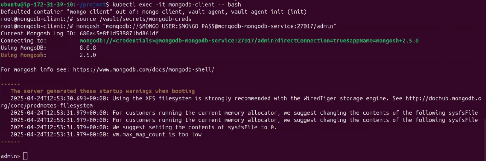

A connection got established successfully!

### 5. Testing

Let's execute few commands to check that the database functions correctly

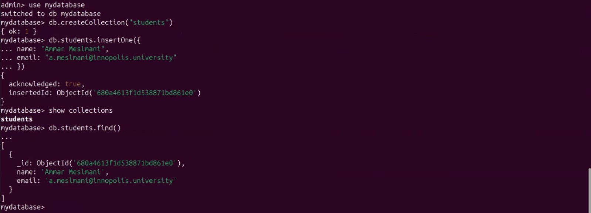

Everything works as expected!

---

## Use Case 4: Login System (By Ammar)

In this section we will create a `Flask-App Server` with hardcoded username/password, save them as secrets inside `vault`, and inject them to a client pod

### 1. Create Flask-App

Let's mock up a server by creating a `Flask-App` with hardcoded credintials which accepts post request and returns a successful response only when the recieved credintials match the hardcoded ones

```
from flask import Flask, request, jsonify

app = Flask(__name__)

USERS = {
    "admin": "admin"
}

@app.route('/login', methods=['POST'])
def login():
    data = request.json
    username = data.get('username')
    password = data.get('password')

    if username in USERS and USERS[username] == password:
        return jsonify({"message": "Login successful!"}), 200
    else:
        return jsonify({"error": "Invalid credentials"}), 401

if __name__ == '__main__':
    app.run(host='0.0.0.0', port=5000)
```

and then let's dockerize this app and push it to `Dockerhub`

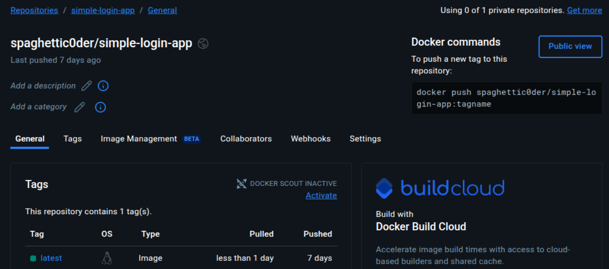

### 2. Deploy The App Using Helm

Let's deploy the pushed docker image using helm chart with the following `values.yaml` file

```
replicaCount: 1
image:
  repository: spaghettic0der/simple-login-app
  pullPolicy: IfNotPresent
  tag: "latest"

serviceAccount:
  create: true
  automount: true
  annotations: {}
  name: ""

service:
  type: ClusterIP
  port: 5000
ingress:
  enabled: false
  className: ""
  annotations: {}
  hosts:
    - host: chart-example.local
      paths:
        - path: /
          pathType: ImplementationSpecific

livenessProbe:
  httpGet:
    path: /
    port: http
readinessProbe:
  httpGet:
    path: /
    port: http

autoscaling:
  enabled: false
  minReplicas: 1
  maxReplicas: 100
  targetCPUUtilizationPercentage: 80
```


### 3. Setup The Secrets

Let's store the previous credintials into vault and verify that they got stored

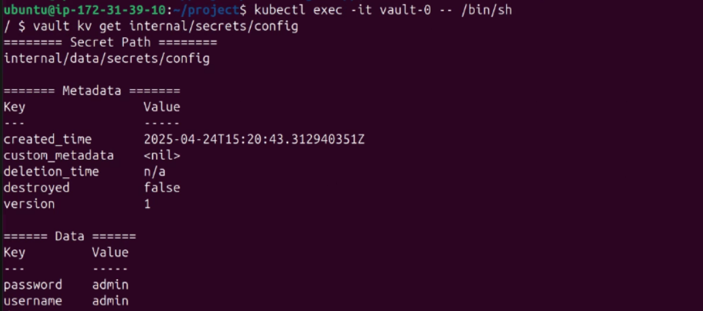

### 4. Create Client Pod

Let's create a client pod which attempts to make a post request to the server using the following `client-pod.yaml`

```
apiVersion: v1
kind: Pod
metadata:
  name: login-client
  annotations:
    vault.hashicorp.com/agent-inject: "true"
    vault.hashicorp.com/role: "internal-app"
    vault.hashicorp.com/agent-inject-secret-flask-creds: "internal/data/secrets/config"
    vault.hashicorp.com/agent-inject-template-flask-creds: |
      {{- with secret "internal/data/secrets/config" -}}
      username={{ .Data.data.username }}
      password={{ .Data.data.password }}
      {{- end }}
spec:
  serviceAccountName: internal-app
  containers:
  - name: app
    image: alpine/curl:latest
    command: ["/bin/sh", "-c"]
    args:
      - |
        echo "Waiting for Vault secrets...";
        while [ ! -f /vault/secrets/flask-creds ]; do sleep 1; done;
        . /vault/secrets/flask-creds;
        echo "Attempting login with username: $username";
        curl -X POST http://flask-login-app:5000/login \
          -H "Content-Type: application/json" \
          -d "{\"username\":\"$username\", \"password\":\"$password\"}";
        sleep 3600
```


### 5. Verify

Let's check the logs to verify that the post request which was sent by the client pod got a successful response by checking the logs of the client pod

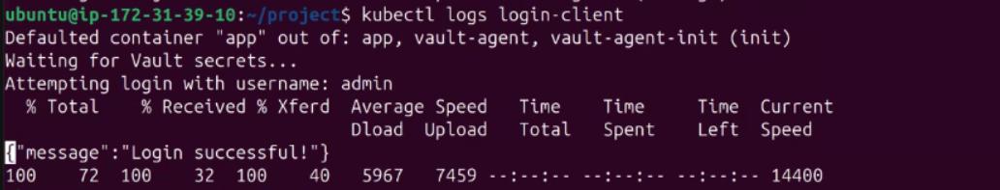

The logs indicate a successful response!
