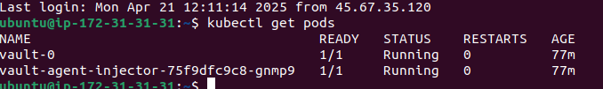
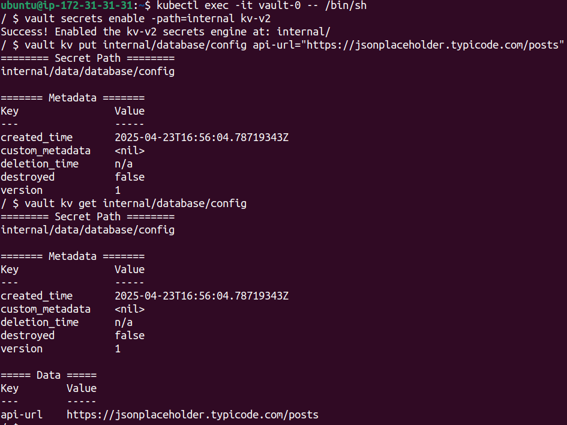
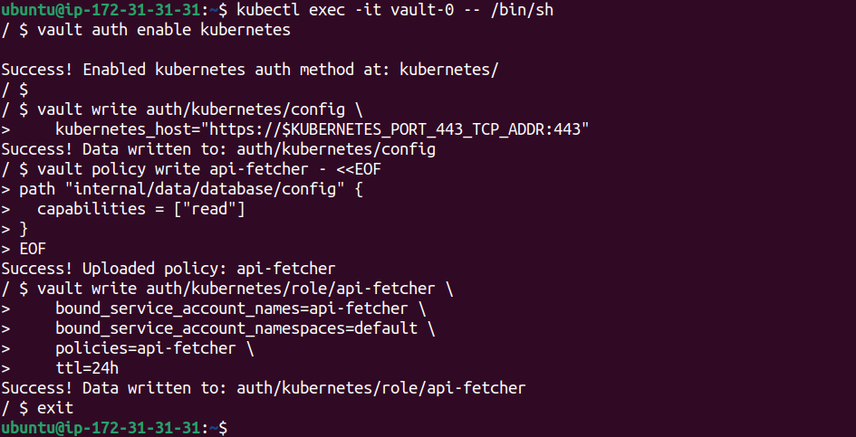
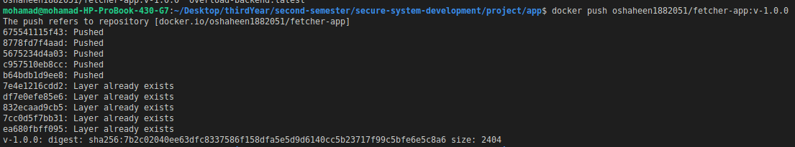
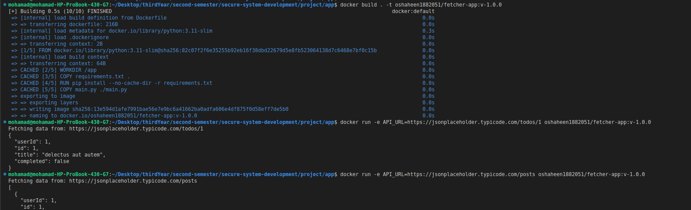
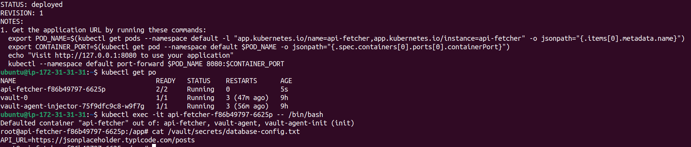
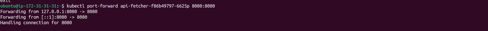
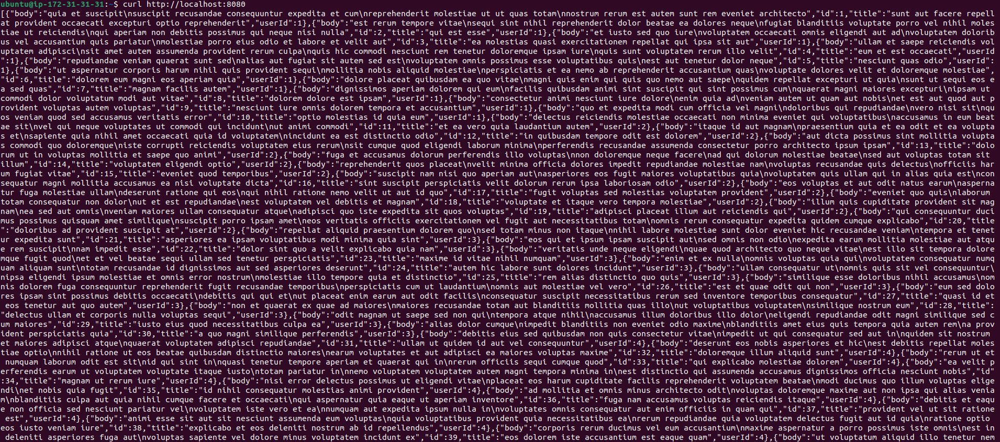

# Using Vault for Secret Management: A Practical Guide with Kubernetes

## Project Overview

This project demonstrates how to use **HashiCorp Vault** for secure secret management within Kubernetes. We'll explore real-world use cases for securely storing and retrieving secrets such as:

1. API URLs Done by **Mohamad**
2. Username and password Done by **Ammar**
3. Token-Based API Access Done by **Ali**
4. Database connection strings Done by **Yehia**

Vault will be integrated with **Kubernetes**.

### Contributors

- Mohamad *(API Fetcher use case)*
- Ali *(Token-Based API use case)*
- Ammar *(Username/password use case)*
- Yehia *(Database URL connection use case)*

---

## Use Case 1: API Fetcher App with Vault (By Mohamad)

In this section, we will create an AWS EC2 instance and deploy a Kubernetes-based application that securely fetches API data using secrets stored in HashiCorp Vault.

---

## 1. Launch an AWS EC2 Instance

Create and connect to an AWS EC2 instance (Ubuntu recommended). Once connected, proceed with the environment setup.

---

## 2. Install Requirements

Install `kubectl`, `minikube`, `docker`, and `helm`, then start Minikube:

```bash
# Download and install Minikube
curl -LO https://github.com/kubernetes/minikube/releases/latest/download/minikube-linux-amd64
sudo install minikube-linux-amd64 /usr/local/bin/minikube && rm minikube-linux-amd64

# Download and install kubectl
curl -LO "https://dl.k8s.io/release/$(curl -L -s https://dl.k8s.io/release/stable.txt)/bin/linux/amd64/kubectl"
sudo install -o root -g root -m 0755 kubectl /usr/local/bin/kubectl

# Optional: Alias kubectl to use minikube's built-in context
alias kubectl="minikube kubectl --"

# Update package lists and install required packages for Docker
sudo apt-get update
sudo apt-get install -y ca-certificates curl

# Create a keyring directory and add Docker's GPG key
sudo install -m 0755 -d /etc/apt/keyrings
sudo curl -fsSL https://download.docker.com/linux/ubuntu/gpg -o /etc/apt/keyrings/docker.asc
sudo chmod a+r /etc/apt/keyrings/docker.asc

# Add Docker's stable repository to APT sources
echo \  
  "deb [arch=$(dpkg --print-architecture) signed-by=/etc/apt/keyrings/docker.asc] https://download.docker.com/linux/ubuntu \  
  $(. /etc/os-release && echo \"${UBUNTU_CODENAME:-$VERSION_CODENAME}\") stable" | \  
  sudo tee /etc/apt/sources.list.d/docker.list > /dev/null

# Update package lists and install Docker packages
sudo apt-get update
sudo apt-get install -y docker-ce docker-ce-cli containerd.io docker-buildx-plugin docker-compose-plugin

# Add current user to Docker group for non-root access
sudo groupadd docker
sudo usermod -aG docker $USER
newgrp docker

# Download and configure the Helm GPG key
curl https://baltocdn.com/helm/signing.asc | gpg --dearmor | sudo tee /usr/share/keyrings/helm.gpg > /dev/null

# Install support for HTTPS transport in APT
sudo apt-get install -y apt-transport-https

# Add the Helm stable repo to APT sources
echo "deb [arch=$(dpkg --print-architecture) signed-by=/usr/share/keyrings/helm.gpg] https://baltocdn.com/helm/stable/debian/ all main" | \
  sudo tee /etc/apt/sources.list.d/helm-stable-debian.list

# Update APT and install Helm
sudo apt-get update
sudo apt-get install helm

# Start a Minikube cluster
minikube start

# Add HashiCorp Vault Helm repository and update
helm repo add hashicorp https://helm.releases.hashicorp.com
helm repo update
```

---

## 3. Deploy Vault and Verify

Follow Vault's documentation to install Vault using Helm. Once installed, confirm the pod is running:

```bash
kubectl get pods
```



---

## 4. Configure Vault Secrets

Enable the KV v2 secrets engine and store your API URL secret:

```bash
# Connect to the Vault pod shell
kubectl exec -it vault-0 -- /bin/sh

# Enable KV v2 secrets engine at custom path "internal"
vault secrets enable -path=internal kv-v2

# Add the API URL secret to Vault
vault kv put internal/database/config api_url="https://jsonplaceholder.typicode.com/posts"

# Retrieve the secret to verify it was added
vault kv get internal/database/config
```



---

## 5. Configure Kubernetes Authentication

Inside the Vault pod:

```bash
# Enable the Kubernetes authentication method
vault auth enable kubernetes

# Configure Vault with the Kubernetes cluster API endpoint
vault write auth/kubernetes/config \
    kubernetes_host="https://$KUBERNETES_PORT_443_TCP_ADDR:443"

# Define a policy to allow read access to the API URL secret
vault policy write api-fetcher - <<EOF
path "internal/data/database/config" {
  capabilities = ["read"]
}
EOF

# Create a Kubernetes authentication role for the app
vault write auth/kubernetes/role/api-fetcher \
    bound_service_account_names=api-fetcher \
    bound_service_account_namespaces=default \
    policies=api-fetcher \
    ttl=24h

# Exit the Vault container
exit
```



---

## 6. Build the API Fetcher App

This Flask-based app fetches data from an external API defined in the `API_URL` environment variable or query parameter.

```bash
# Build the Docker image
docker build . -t oshaheen1882051/fetcher-app:v-1.0.0 --no-cache

# Push the image to Docker Hub
docker push oshaheen1882051/fetcher-app:v-1.0.0
```




[Docker Hub Link for fetcher-app](https://hub.docker.com/r/oshaheen1882051/fetcher-app)

---

## 7. Create Helm Chart for `api-fetcher`

Create the chart:

```bash
helm create api-fetcher
```

### Update `values.yaml`

```yaml
image:
  repository: oshaheen1882051/fetcher-app
  pullPolicy: Always
  tag: "v-1.0.0"

serviceAccount:
  create: true
  automount: true
  name: "api-fetcher"

vault:
  secretPath: "internal/data/database/config"
  secretKey: "api_url"
  role: "api-fetcher"

service:
  type: ClusterIP
  port: 8080
```

### Update `templates/deployment.yaml` annotations

```yaml
annotations:
  vault.hashicorp.com/agent-inject: "true"
  vault.hashicorp.com/role: "{{ .Values.vault.role }}"
  vault.hashicorp.com/agent-inject-secret-database-config.txt: "{{ .Values.vault.secretPath }}"
  vault.hashicorp.com/agent-inject-template-database-config.txt: |
    {{`{{- with secret "`}}{{ .Values.vault.secretPath }}{{`" -}}`}}
    API_URL={{`{{ .Data.data.api_url }}`}}
    {{`{{- end }}`}}
```

---

## 8. Deploy the Chart

```bash
# Install the Helm chart for the application
helm install api-fetcher ./api-fetcher/
```



---

## 9. Test the API Fetcher App

Forward the service port and make a request:

```bash
# Forward port 8080 from the pod to localhost
kubectl port-forward api-fetcher-f86b49797-6625p 8080:8080

# Send a test request to the running app
curl http://localhost:8080
```




---

This use case by **Mohamad** demonstrates how to securely inject secrets into a Kubernetes-based application using Vault and Helm and retrive data from api.
